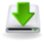

# dash-formulaone-2021

Speed Painel para o jogo Formula 1  PC
Testado no Formula 1 21 e 22

## Painel

- REV-Light

- DRS on/off

- Volta

- Posição

- Velocidade KM/H

- Marcha

- Tempo última volta

## Pré-requisitos

Telemetria via UDP ativada no jogo 👇

## Rodando

No computador baixe o e inicie o executável

No seu celular ou tablet abra o navegador e digite o ip do computador na porta 3000

> exemplo -> 192.168.1.4:3000

## Credits

- [f1-2021-udp](https://github.com/raweceek-temeletry/f1-2021-udp#readme)
