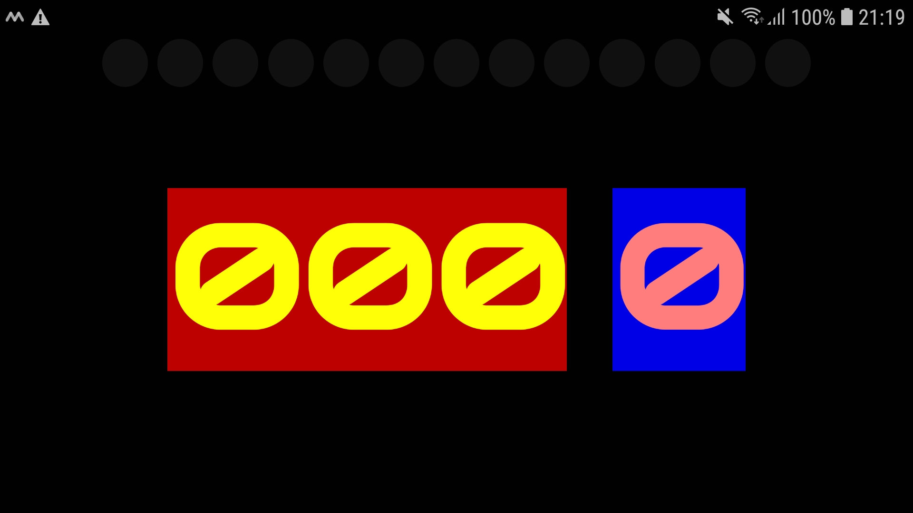
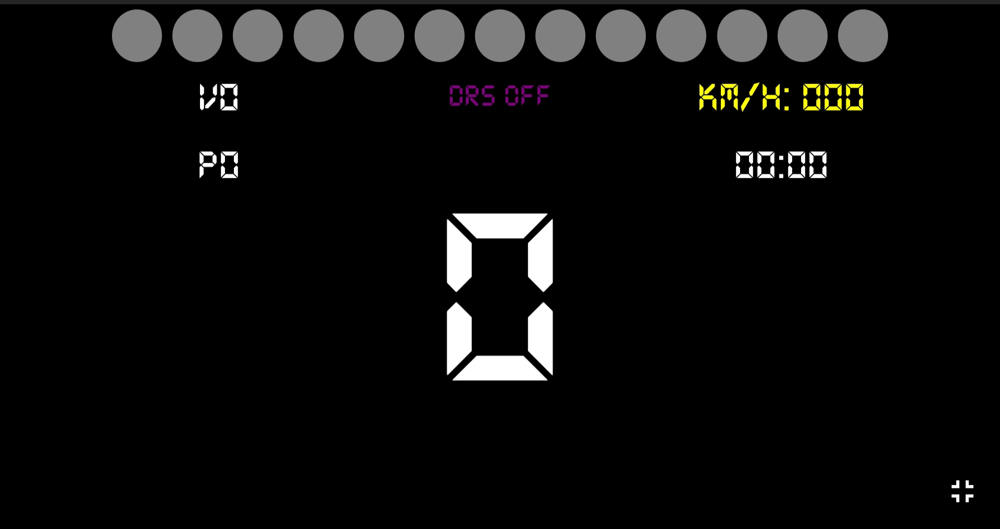
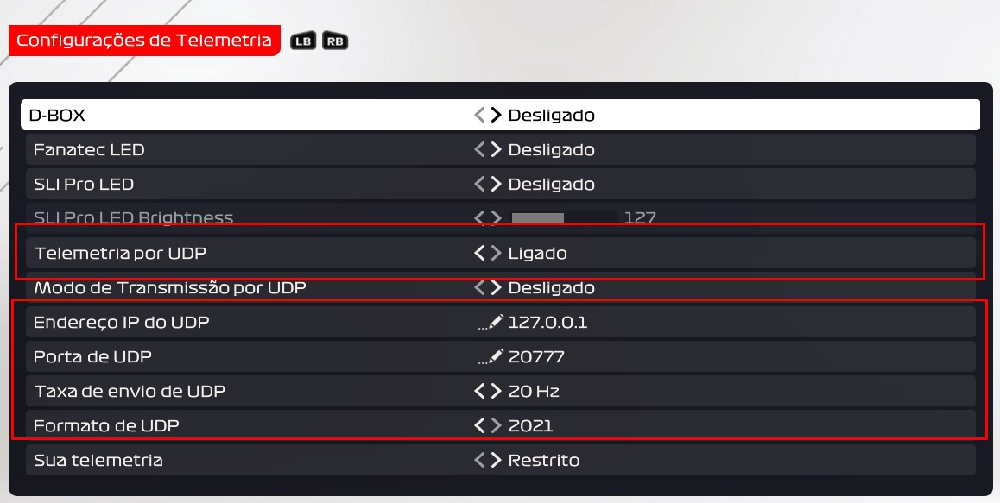
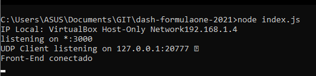

# dash-formulaone-2021

Speed Painel para o jogo Formula 1 2021 PC


## Painel

### V 0.01

- RPM
- Velocidade em KM/H
- Marcha



### V 1.0.0

- REV-Light

- DRS on/off

- Volta

- Posição

- Velocidade KM/H

- Marcha

- Tempo última volta



## Pré-requisitos

Necessário ter o [NodeJS](https://nodejs.org/en/download/)

Telemetria via UDP ativada no jogo 👇



## Rodando

Para executar é só na pasta raiz rodar o comando 

```
node index.js
```

No seu celular ou tablet abra o navegador e digite o ip do computador na porta 3000

> exemplo -> 192.168.1.4:3000



## Credits

- [f1-2021-udp](https://github.com/raweceek-temeletry/f1-2021-udp#readme)